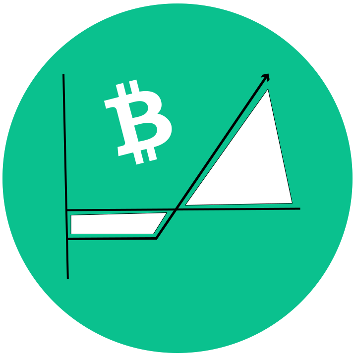

<div align="center">
  
</div>

<div align="center" style="margin-top: 10px">
  <p><strong>options.cash:&nbsp;</strong>On-chain options on Bitcoin Cash</p>
</div>

> Try it now: [https://bchoptions.cash](https://bchoptions.cash)

[](https://app.netlify.com/sites/angry-ramanujan-36e441/deploys)

[]()
[]()

## 🔍 About
**options.cash** aims to bring decentralized non-custodial options to Bitcoin Cash through covenant contracts and price oracles. Options are a type of derivative in which the investor pay for the right to optionally buy or sell an asset at an agreed-upon price and date.

With DeFi protocols like AnyHedge gaining more adoption on BCH, our goal is to serve as an tool to manage portfolio risks and returns.

The initial idea is to deliver an user-friendly UX to trade options of some BCH/SLP pairs. We may provide anyhedge functionalities and go even further creating ways to tokenize AnyHedge positions and use them in options strategies, providing a whole set of derivatives for BCH!

## 🎥 Overview
<a href="https://www.youtube.com/watch?v=9-OkfALrbBU">
	
</a>

## 🚀 Run
```bash
yarn start
```
