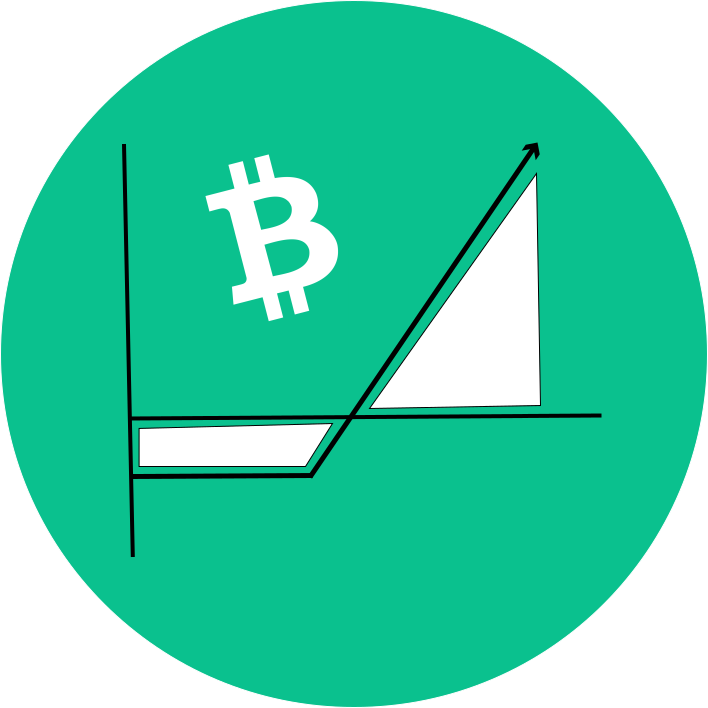

<div align="center">
  
</div>

<div align="center" style="margin-top: 10px">
  <p><strong>options.cash:&nbsp;</strong>On-chain options on Bitcoin Cash</p>
</div>

> Try it now: [https://bchoptions.cash](https://bchoptions.cash)

[](https://app.netlify.com/sites/angry-ramanujan-36e441/deploys)

[]()
[]()

<hr>

## 🔍 Project Overview
**options.cash** aims to bring on-chain options to Bitcoin Cash through covenant contracts and price oracles. Options are a type of derivative in which the investor pays for the right to optionally buy or sell an asset at an agreed-upon price and date.

With DeFi protocols like AnyHedge gaining more adoption on BCH, our goal is to serve as a tool to manage portfolio risks and returns.

The idea is to deliver a user-friendly UX to trade options of some SLP/BCH pairs.

<hr>

## 🎥 Presentation Video
<a href="https://www.youtube.com/watch?v=eoJzMnP0saE">
	
</a>

<hr>

## 🖼 Screenshots and gifs
<table>
  <thead>
    <tr>
      <th>
        Trading screen!
      </th>
      <th>
        Embedded wallet!
      </th>
    </tr>
  </thead>
  <tbody>
    <tr>
      <td>
        <a href="https://bchoptions.cash/#/trade">
          
        </a>
      </td>
      <td>
        <a href="https://bchoptions.cash/#/trade">
          
        </a>
      </td>
    </tr>
  </tbody>
</table>

<hr>

## 🚀 Run
```bash
yarn start
```


## 💡 Inspiration
Options can be really helpful to protect a portfolio, as someone interested in getting it only needs to pay a relatively small premium. On the other hand, one may want to sell the rights of
an asset in order to get some cash in the present. The idea to build it on-chain comes while studying stock options, and Cash Script will help to turn this real.
Ethereum already has on-chain options, like https://www.hegic.co/, but the high gas fees make it much less attractive.

<hr>

## ❓ What it Does
Cash Script Covenants are the final pieces to have it done on-chain. With convenats only few steps will be required, they are:


<br>

### **1. `Option Writer` writes an intermediary contract**
>In this step, `Option Writer` creates a contract locking some asset (SLP token), and at any moment can abort and recover it.

### **2. `Option Buyer` pay the premium to the `Option Writer`, and a new contract is generated (in a single transaction)**

### **3. At the expiration date, the `Option Buyer` decides to execute or not the contract**
If the buyer does not execute the contract, the `Option Writer` will be able to restore its funds without any loss.

We decided to create an embedded wallet to make some steps easier, but it could be done
completely with any wallet supporting our protocol.

<hr>

## 🎛 How We Built It
Technologies:
- Typescript
- React
- Styled-Components
- Cash Script
- slp-sdk
- https://github.com/jcramer/bitcore-lib-fun

<hr>

## 👊 Declarations
We used the experience acquired building [Mint](https://mint.bitcoin.com/) to create a great UX!

It's been a great experience to participate in this Hackathon and learn more about derivatives, options strategies, Cash Script, video editing, and more.

<hr>

## 🚀 What’s Next
We did not finish it yet! Progress:

- [x] Git repository
- [x] Domain options.cash
- [x] Most important UI elements
- [x] Understand how to do this with Cash Script
- [x] Embedded wallet
- [ ] Run the price oracles
- [ ] Write options, Trade options and Execute options

We will proceed with the missing steps in the next days, and then release an MVP!

## 🙏 Help us to build it
<table>
  <thead>
    <tr>
      <th>
        BCH Address
      </th>
      <th>
        SLP Address
      </th>
    </tr>
  </thead>
  <tbody>
    <tr>
      <td>
        
        <p>bitcoincash:qprwefsn9qnz9zxx72948n7s52lk93nfpqqq5tda9t</p>
      </td>
      <td>
        
        <p>simpleledger:qrt9q69sypxxaypugxptaaz57l4gnq0x4yvl0ns0f2</p>
      </td>
    </tr>
  </tbody>
</table>